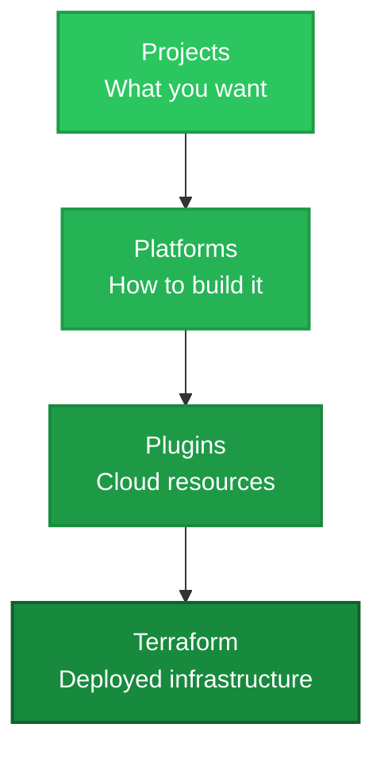

Suga is built on a clear separation of concerns that enables both developer productivity and platform governance. Understanding these core concepts will help you make the most of the platform.

## The Suga Architecture

Suga operates through three key layers that work together to transform your application designs into deployed infrastructure:



### 1. Projects: What You Want

[Projects](/core/projects) are your application specifications - declarative YAML files that describe what your application needs:

- **Services** - Application containers that run your code
- **Buckets** - Cloud storage for files and assets
- **Databases** - PostgreSQL databases for structured data
- **Entrypoints** - HTTP routing and CDN configuration

Projects are **deployment-agnostic** - they describe requirements without specifying how they're implemented.

```yaml title="Example: A simple web application"
target: suga/aws@1
name: my-app

services:
  api:
    dev:
      script: npm run dev

buckets:
  uploads:
    access:
      api: [read, write]

entrypoints:
  web:
    routes:
      /api/: 
        name: api
```

### 2. Platforms: How to Build It

[Platforms](/core/platforms) are blueprints that map your project's abstract resources to specific cloud implementations. They define:

- Which cloud services to use (Lambda vs Fargate, S3 vs Cloud Storage)
- How to configure those services (memory, CPU, networking)
- Security policies and access controls
- Infrastructure dependencies (VPCs, load balancers)

Platform teams create and publish platforms to enforce organizational standards while delivering seamless developer experiences.

### 3. Plugins: Cloud Resources

[Plugins](/core/plugins) are the lowest-level building blocks - reusable Terraform modules that provision specific cloud resources. Each plugin contains:

- **Terraform module** - Infrastructure-as-code for a specific cloud service
- **Input schema** - Configuration properties the module accepts
- **Runtime adapter** (optional) - Go code that translates SDK calls to cloud APIs

Platforms compose multiple plugins to create complete deployment targets.

## The Suga Workflow

Understanding how these pieces work together:

<Steps>
  <Step title="Design">
    Create your project using the visual editor or by editing `suga.yaml` directly.

    ```bash
    suga edit  # Visual editor
    # or edit suga.yaml manually
    ```
  </Step>

  <Step title="Develop Locally">
    Test your application with emulated cloud services running locally.

    ```bash
    suga dev
    ```

    Local development provides:
    - Hot reloading for code changes
    - Emulated buckets, entrypoints, and databases
    - Fast iteration without cloud costs
  </Step>

  <Step title="Generate Infrastructure">
    Build Terraform infrastructure from your project and target platform.

    ```bash
    suga build
    ```

    This process:
    1. Loads your project specification (`suga.yaml`)
    2. Fetches the target platform definition
    3. Maps each resource to appropriate plugins
    4. Generates Terraform modules with proper configuration
    5. Creates IAM policies for service access
    6. Outputs a complete Terraform stack
  </Step>

  <Step title="Deploy">
    Deploy the generated Terraform to your cloud provider.

    ```bash
    cd terraform/stacks/my-app
    terraform init
    terraform apply
    ```

    Standard Terraform workflow - you have full control over deployment timing, preview changes with `terraform plan`, and manage state as you normally would.
  </Step>
</Steps>

## Key Concepts

### Declarative Infrastructure

Suga uses a declarative approach - you specify **what** you want, not **how** to create it.

```yaml title="Declarative: What you want"
buckets:
  uploads:
    access:
      api: [read, write]
```

Suga handles the **how**:
- Creates S3 bucket (AWS) or Cloud Storage bucket (GCP)
- Configures IAM policies for service access
- Sets up lifecycle rules and encryption
- Generates connection configuration

### Separation of Concerns

Suga maintains clear boundaries between different responsibilities:

| Layer | Responsibility | Owned By |
|-------|---------------|----------|
| **Project** | Application requirements | Developers |
| **Platform** | Implementation strategy | Platform teams |
| **Plugin** | Cloud resource provisioning | Plugin authors |
| **Terraform** | Infrastructure deployment | DevOps/SRE |

This separation enables:
- Developers to focus on application needs
- Platform teams to enforce standards
- Infrastructure to evolve independently
- Teams to work in parallel

### Infrastructure as Configuration

Unlike infrastructure as **code** (where you write Terraform/Pulumi), Suga treats infrastructure as **configuration**:

- **Configuration** - High-level, declarative, human-readable
- **Code** - Generated automatically, optimized, consistent

You edit configuration, Suga generates code.

### Platform-Driven Governance

Platforms act as governance boundaries:

```yaml title="Developer specifies requirements"
services:
  api:
    # I need a service
```

```yaml title="Platform enforces standards"
services:
  lambda:
    properties:
      memory: 512  # Organization-mandated memory
      timeout: 10  # Organization-mandated timeout
    identities:
      - plugin: iam-role  # Auto-generated IAM with least privilege
```

Platform teams control:
- Which cloud services are available
- How they're configured by default
- What developers can customize
- Security and compliance policies

### Runtime Abstraction (Optional)

If you use Suga's generated SDKs, the same code works everywhere:

```typescript title="Cloud-agnostic code"
import { SugaClient } from './suga/client';

const suga = new SugaClient();

// Works locally with suga dev
// Works on AWS Lambda with S3
// Works on GCP Cloud Run with Cloud Storage
await suga.uploads.write('file.txt', data);
```

Plugins provide runtime adapters that translate abstract operations to cloud-specific APIs.

## Design Principles

Suga is built on several core principles:

### 1. Visual-First Design

Infrastructure should be visual and intuitive. The visual editor provides:
- Drag-and-drop resource creation
- Visual connections show relationships
- Real-time validation
- AI-assisted architecture design
- Automatic YAML generation

### 2. Local Development First

Developers should be able to work entirely locally without cloud access:
- Emulated cloud services
- Fast iteration cycles
- No cloud costs during development
- Consistent behavior between local and production

### 3. Standard Artifacts

Suga generates standard, transparent artifacts:
- **Terraform HCL** - Not proprietary formats
- **Standard providers** - AWS, GCP, Azure Terraform providers
- **No magic** - Generated Terraform is readable and customizable

### 4. Progressive Enhancement

Start simple, add complexity as needed:
- Begin with default platform configurations
- Customize as requirements grow
- Create custom platforms for specialized needs
- Build custom plugins for unique resources

### 5. Team Scalability

Enable teams to work independently while maintaining consistency:
- Platform teams publish reusable blueprints
- Development teams consume platforms
- Plugin authors create building blocks
- Clear interfaces between layers

## Next Steps

Now that you understand Suga's core concepts, dive deeper into each component:

<CardGroup cols={2}>
  <Card title="Projects" icon="file-code" href="/core/projects">
    Learn how to define application requirements
  </Card>

  <Card title="Platforms" icon="layers" href="/core/platforms">
    Understand platform blueprints and governance
  </Card>

  <Card title="Plugins" icon="puzzle" href="/core/plugins">
    Explore the building blocks of infrastructure
  </Card>

  <Card title="Infrastructure Generation" icon="cog" href="/core/infrastructure-generation">
    See how Suga transforms projects into Terraform
  </Card>

  <Card title="Local Development" icon="laptop" href="/core/local-development">
    Master local development workflow
  </Card>

  <Card title="Deployment" icon="rocket" href="/deploy/overview">
    Understand deployment and operations
  </Card>
</CardGroup>

Or jump straight to building:

<Card title="Build Your First App" icon="hammer" href="/quickstart" horizontal>
  Follow the quickstart guide to deploy an application end-to-end
</Card>
