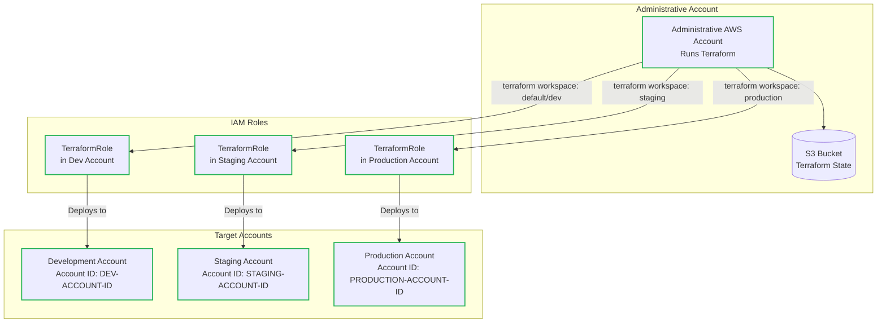

## Overview

Terraform workspaces provide a way to manage multiple environments using the same configuration with separate state files. This guide shows how to configure workspace-based deployments for Suga-generated stacks.


## Prerequisites

This guide assumed you've have the following:
- An established [multi-account AWS Architecture](#multi-account-architecture) with appropriate IAM roles.
- A remote backend configured for Terraform state storage.
- That you've build your Terraform configuration using `suga build`.

## Multi-Account Architecture

This workspace configuration uses a multi-account architecture with cross-account role delegation:



Each target account has a `TerraformRole` that trusts the administrative account, allowing Terraform to assume the role and deploy resources to the appropriate environment.

Terraform provides a great guide on getting started with this in their s3 backend configuration: https://developer.hashicorp.com/terraform/language/backend/s3#multi-account-aws-architecture

## Workspace Configuration (Using AWS as an Example)

After running `suga build`, create a `providers.tf` file in your Terraform stack directory to configure workspace-based deployments:

```hcl title="terraform/stacks/<stack_name>/providers.tf" icon="file"
# Access delegation by workspace
# https://developer.hashicorp.com/terraform/language/backend/s3#delegating-access
variable "workspace_iam_roles" {
  default = {
    # Default to development account
    default    = "arn:aws:iam::DEV-ACCOUNT-ID:role/TerraformRole"
    dev        = "arn:aws:iam::DEV-ACCOUNT-ID:role/TerraformRole"
    staging    = "arn:aws:iam::STAGING-ACCOUNT-ID:role/TerraformRole"
    production = "arn:aws:iam::PRODUCTION-ACCOUNT-ID:role/TerraformRole"
  }
}

provider "aws" {
  assume_role {
    # Falls back to dev account if workspace doesn't exist (useful for PR previews)
    role_arn = lookup(var.workspace_iam_roles, terraform.workspace, var.workspace_iam_roles["dev"])
  }
}
```

This configuration:
- Maps each workspace to a specific AWS account via IAM role delegation
- Falls back to the development account for undefined workspaces (useful for PR preview environments)
- Provides complete environment isolation at the AWS account level

## Using Workspaces

Create and switch between workspaces for different environments:

```bash title="Workspace Commands" icon="terminal"
# Create workspaces
terraform workspace new staging
terraform workspace new production

# List workspaces (* indicates current)
terraform workspace list

# Switch workspace
terraform workspace select staging

# Deploy to current workspace
terraform apply
```

## CI/CD Integration

Example GitHub Actions workflow for automated deployments:

```yaml title=".github/workflows/deploy.yml" icon="github"
name: Deploy Infrastructure

on:
  push:
    branches: [staging, production]

jobs:
  deploy:
    runs-on: ubuntu-latest
    steps:
      - uses: actions/checkout@v3
      
      - name: Setup Terraform
        uses: hashicorp/setup-terraform@v2
        
      - name: Determine Environment
        id: env
        run: echo "environment=${GITHUB_REF#refs/heads/}" >> $GITHUB_OUTPUT
        
      - name: Terraform Init & Apply
        run: |
          cd terraform/stacks/<stack_name>
          terraform init
          terraform workspace select ${{ steps.env.outputs.environment }} || \
            terraform workspace new ${{ steps.env.outputs.environment }}
          terraform apply -auto-approve
```
    This workflow:
    - Triggers on pushes to staging or production branches
    - Automatically selects or creates the appropriate workspace
    - Deploys changes to the corresponding AWS account
## Further Reading

- [Terraform Workspaces Documentation](https://developer.hashicorp.com/terraform/language/state/workspaces)
- [AWS S3 Backend with Delegation](https://developer.hashicorp.com/terraform/language/backend/s3#delegating-access)
- [Terraform Backend Configuration Guide](/guides/terraform-backend-config)