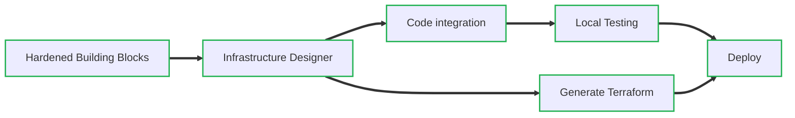

Suga makes cloud development simple by combining visual infrastructure design with automatic Terraform generation for your cloud of choice. Build applications with any framework, test locally with emulated cloud resources, and deploy anywhere with production-ready Terraform.



<Card title="Get Started" icon="rocket" href="/quickstart" horizontal>
  Deploy your first application in minutes with the quickstart guide.
</Card>

## What is Suga?

Suga is a cloud development platform that adds infrastructure capabilities to your applications. You can add Suga to your existing app with minimal changes, or create a new project from scratch using templates.

<div className="relative h-96 overflow-hidden">
  <video 
    className="w-full h-full object-cover object-top"
    autoPlay 
    loop 
    muted 
    playsInline
    preload="metadata"
    poster="/images/project-editor-poster.jpg"
    aria-label="Demo of the Suga visual project editor showing drag-and-drop infrastructure design"
  >
    <source src="/images/project-editor.webm" type="video/webm" />
    Your browser does not support the video tag.
  </video>
  <div className="absolute bottom-0 left-0 right-0 h-15 bg-gradient-to-t from-white to-transparent dark:from-gray-900 pointer-events-none"></div>
</div>

Suga provides:

- **Visual infrastructure design** - Design your cloud architecture with drag-and-drop components
- **Framework flexibility** - Works as an add-on to Express, Django, FastAPI, Go HTTP, and other frameworks
- **Local cloud emulation** - Develop and test with local versions of cloud services (S3, databases, queues)
- **Multi-cloud deployment** - Generate Terraform for AWS, GCP, or Azure from the same design
- **Team collaboration** - Infrastructure definition separate from application code

## How Suga Works

<Steps>
  <Step title="Design">
    Use the visual editor to design your application architecture. Drag Entrypoints, databases, storage, and other resources onto the canvas and connect them together.
  </Step>
  <Step title="Develop">
    Optionally, generate type-safe client libraries for your chosen language. Build your application using familiar frameworks while Suga handles cloud resource access.
  </Step>
  <Step title="Deploy">
    Generate production-ready Terraform infrastructure code. Deploy to any cloud provider with confidence, knowing your infrastructure follows best practices.
  </Step>
</Steps>

## Two Ways to Get Started

### Add to Existing Applications

Add Suga to your existing TypeScript, Python, or Go application with minimal changes. Run `suga init` to get started, then use the visual editor to design your cloud infrastructure. Optionally, replace your existing cloud SDK calls with Suga's unified API for seamless multi-cloud compatibility.

- **Minimal integration** - Works with your existing codebase and deployment process
- **Visual infrastructure design** - Design cloud resources visually or by editing YAML
- **Unified cloud API** - Replace AWS, GCP, or Azure SDKs with one consistent interface
- **Production deployment** - Generate battle-tested Terraform for any cloud provider

[Add Suga to your existing app →](/guides/add-suga)
  
### Start a New Application from a Template

Create new projects from templates that include both application code and infrastructure setup for popular frameworks:

- **Node.js + Express** - REST API with TypeScript
- **Python + FastAPI** - Modern async API with automatic documentation  
- **Python + Django** - Full-featured web framework setup
- **Go + HTTP** - Lightweight HTTP server with standard library

[Create a new project →](/quickstart)

## Visual Infrastructure Design

Design your cloud architecture with a drag-and-drop interface that automatically generates and maintains your infrastructure configuration.


The visual editor provides:
- **Resource library** - Drag databases, storage, services and entrypoints onto your canvas
- **Resource connections** - Visual connections configure access permissions and routing
- **Live validation** - Real-time feedback on architecture constraints
- **AI assistant** - Ask the Suga assistant to help you design the perfect architecture
- **YAML sync** - Changes automatically update your local `suga.yaml` file

## Local Development Experience

Develop and test cloud applications entirely on your local machine with emulated cloud services.

```bash title="terminal" icon="terminal"
suga dev 

 ⚡ Suga v0.0.1
    - App: example
    - Addr: :50051
    - Dashboard: https://app.addsuga.com/dev

Services

✓ Starting [app]

Entrypoints

✓ Starting [ingress] http://localhost:3001

Use Ctrl-C to exit
```

Local development includes:
- **Service emulation** - Local versions of buckets, entrypoints (websites/CDN), databases (coming soon), and other cloud resources
- **Hot reloading** - Your application restarts automatically when code changes
- **Real-time logs** - See application and infrastructure logs in one place
- **Easy debugging** - Standard debugging tools work normally with local services

## Multi-Cloud Deployment

Deploy the same application to different cloud providers or move between services on the same provider without changing your code. Suga generates provider-specific Terraform modules from your infrastructure definition.

```bash title="terminal" icon="terminal"
suga build

 ✓ Terraform generated successfully
   output written to terraform/stacks/example

Next steps:
1. Run cd terraform/stacks/example to move to the stack directory
2. Initialize the stack terraform init -upgrade
3. Optionally, preview with terraform plan
4. Deploy with terraform apply
```

Supported cloud providers:
- **AWS** - Lambda, ECS, S3, and more
- **Google Cloud** - Cloud Run, Cloud Storage, etc.
- **Azure** - Coming soon
- **Kubernetes** - Coming soon and BYO

## Architecture

Suga separates infrastructure definition from application code:

- **Infrastructure as configuration** - Define cloud resources in suga.yaml, separate from application logic
- **Generated client libraries** - Type-safe resource access generated from your infrastructure definition  
- **Standard deployment artifacts** - Produces Terraform modules that integrate with existing DevOps workflows
- **Modular providers** - Granular plugins at the resource level enable custom cloud configurations

Built by the team behind [Nitric](https://nitric.io), Suga incorporates lessons learned from years of cloud framework development.

## Resources

<Columns cols={2}>
  <Card title="GitHub" icon="github" href="https://github.com/nitrictech/suga">
    View the source code and contribute to the project.
  </Card>
  <Card title="Support" icon="question" href="mailto:support@addsuga.com">
    Get help from our support team.
  </Card>
</Columns>
