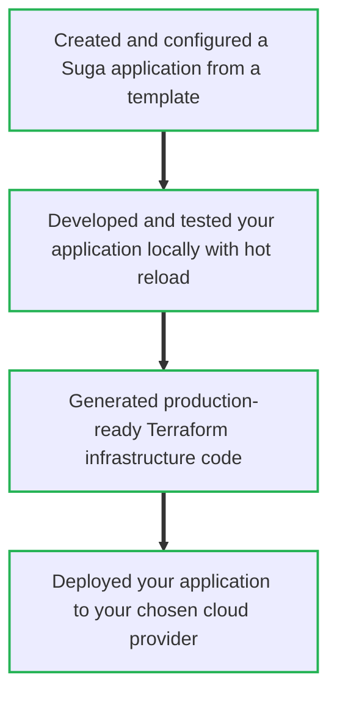

Deploy your first application on the Suga platform in just a few steps. The Suga CLI provides everything you need to build cloud-native applications with automatic infrastructure generation and multi-cloud deployment capabilities.

<Note>
  **Prerequisites:** This guide assumes you have the Suga CLI installed. If you
  need to install it, see our [Installation Guide](/installation) for
  platform-specific instructions.
</Note>

<Steps>
  <Step title="Create Your Project" icon="rocket">
    Create a new project from a template:

    ```bash title="Create New Project" icon="sparkles"
    suga new my-first-app
    ```

    Select a template that matches your use case:
    ```bash
    Welcome to Suga, this command will help you create a project from a template.
    If you already have a project, run suga init instead.

    Project name: my-first-app
    Template:
    ➜ suga/go-standard
      suga/python-django-pip
      suga/python-fastapi-uv
      suga/typescript-express

    Template: suga/go-standard

    ✓ Project created!
    ```
  </Step>

  <Step title="Design Your Architecture" icon="pencil-line">
    Log in and open the visual editor:

    ```bash title="Login to Suga" icon="user"
    suga login
    ```

    You'll see a confirmation:
    ```bash
    ⚡ Suga Logging in...

    ✓ Logged in as User
    ```

    Open the visual editor:

    ```bash title="Open Visual Editor" icon="edit"
    suga edit
    ```

    The editor launches in your browser:
    ```bash
    ⚡ Suga Editor
    Opening visual editor at http://localhost:3001
    Press Ctrl+C to stop the editor
    ```

    Use the visual editor to design your APIs, databases, storage, and other cloud resources with drag-and-drop simplicity.

    

    <Tip>
      The editor automatically updates your `suga.yaml` file as you make changes.
    </Tip>

    Let's review what the `go-standard` template has defined in the `suga.yaml`:

    ```yaml title="suga.yaml" icon="file-code"
    targets:
      - suga/aws@1
    name: go-standard
    description: A Go web service template using the Suga framework for cloud resource access.
    services:
      app:
        env:
          TEST: test
        container:
          docker:
            dockerfile: Dockerfile
            context: .
        dev:
          script: go run main.go
    buckets:
      files:
        access:
          app:
            - read
            - write
    entrypoints:
      ingress:
        routes:
          /:
            name: app
    ```

    The template includes:
    - **targets**: AWS deployment configuration
    - **services**: Your `app` service with local dev script and Docker container setup
    - **buckets**: A `files` bucket that your app can read from and write to
    - **entrypoints**: An HTTP endpoint that routes traffic to your app

  </Step>

  <Step title="Develop Locally" icon="code">

  Navigate to your project and install dependencies:

    ```bash title="Navigate to Project" icon="folder"
    cd my-first-app
    ```

    <Tabs>
      <Tab title="Node.js">
        ```bash title="Install Dependencies (node)" icon="cube"
        suga generate --ts --ts-out ./suga/client
        npm install
        ```
      </Tab>
      <Tab title="Python">
        ```bash title="Install Dependencies (uv)" icon="cube"
        suga generate --python --python-out ./suga_gen
        uv sync
        ```

        Or with pip:
        ```bash title="Install Dependencies (pip)" icon="cube"
        suga generate --python --python-out ./suga_gen
        pip install -r requirements.txt
        ```
      </Tab>
      <Tab title="Go">
        ```bash title="Install Dependencies (go)" icon="cube"
        suga generate --go --go-out ./suga --go-package-name suga
        go mod tidy
        ```
      </Tab>
    </Tabs>

    <Info>
      Your project structure will include `suga.yaml` for configuration, service code, and language-specific dependencies.
    </Info>

    Start the development server:

    ```bash title="Start Development Server" icon="play"
    suga dev
    ```

    Your application starts with hot reload:

    ```bash
    ⚡ Suga v1.0.0
       - App: my-first-app
       - Addr: http://localhost:50051
       - Dashboard: https://app.addsuga.com

    Services

    ✓ Starting [api]

    Entrypoints

    ✓ Starting [main] http://localhost:3000

    Use Ctrl-C to exit
    ```

    Test your application:

    ```bash title="Test Application" icon="check-circle"
    curl http://localhost:3000/hello
    ```

    Expected response:
    ```json
    {"message": "Hello World"}
    ```

    <Info>
      Services automatically restart when you update your code, providing instant feedback during development.
    </Info>

  </Step>

  <Step title="Deploy to Cloud" icon="cloud">
    Configure your deployment targets in the visual editor or add them to `suga.yaml`:

    ```yaml title="suga.yaml" icon="file-code"
    targets:
      - suga/aws@1
      - suga/gcp@1
    ```

    <Note>
      The template has been set up to use AWS, you can also use GCP. These targets are officially supported.
    </Note>

    Generate Terraform configuration:

    ```bash title="Build Application" icon="hammer"
    suga build
    ```

    You'll see the build output as a terraform stack with everything needed to deploy your application to the cloud:
    ```bash
    ✓ Terraform generated successfully
      output written to ./.suga/stacks/my-first-app-aws-12345

    Next steps:
    1. Run cd ./.suga/stacks/my-first-app-aws-12345 to move to the stack directory
    2. Initialize the stack terraform init -upgrade
    3. Optionally, preview with terraform plan
    4. Deploy with terraform apply
    ```

    Configure cloud provider credentials:

    <Tabs>
      <Tab title="AWS">
        ```bash title="Configure AWS" icon="aws"
        aws configure
        ```
      </Tab>
      <Tab title="GCP">
        ```bash title="Configure GCP" icon="google"
        gcloud auth application-default login
        ```
      </Tab>
    </Tabs>

    Deploy with Terraform:

    ```bash title="Navigate to Stack" icon="folder"
    cd .suga/stacks/my-first-app-aws-*
    ```

    ```bash title="Initialize Terraform" icon="download"
    terraform init -upgrade
    ```

    ```bash title="Preview Changes" icon="eye"
    terraform plan
    ```

    ```bash title="Deploy Application" icon="rocket"
    terraform apply
    ```

    Confirm when prompted:
    ```bash
    Do you want to perform these actions?
      Terraform will perform the actions described above.
      Only 'yes' will be accepted to approve.

      Enter a value: yes

    Apply complete! Resources: 15 added, 0 changed, 0 destroyed.

    Outputs:
    api_endpoint = "https://api.my-first-app.example.com"
    ```

    <Warning>
      Review the Terraform plan carefully before applying to understand what resources will be created in your cloud account.
    </Warning>

  </Step>
</Steps>

**What you've accomplished:**



<Note>
  **Need help?** Contact [support@addsuga.com](mailto:support@addsuga.com) or
  check our [GitHub](https://github.com/nitrictech/suga).
</Note>
